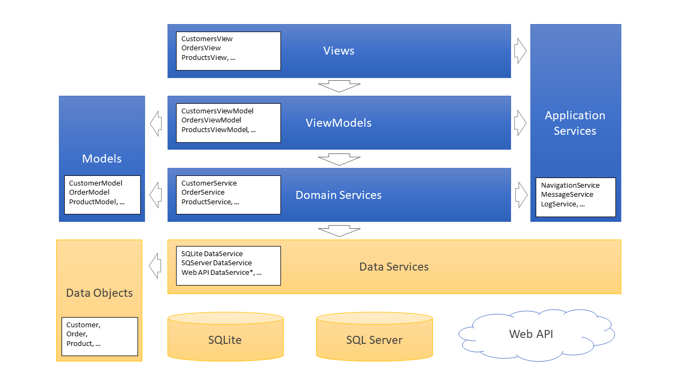
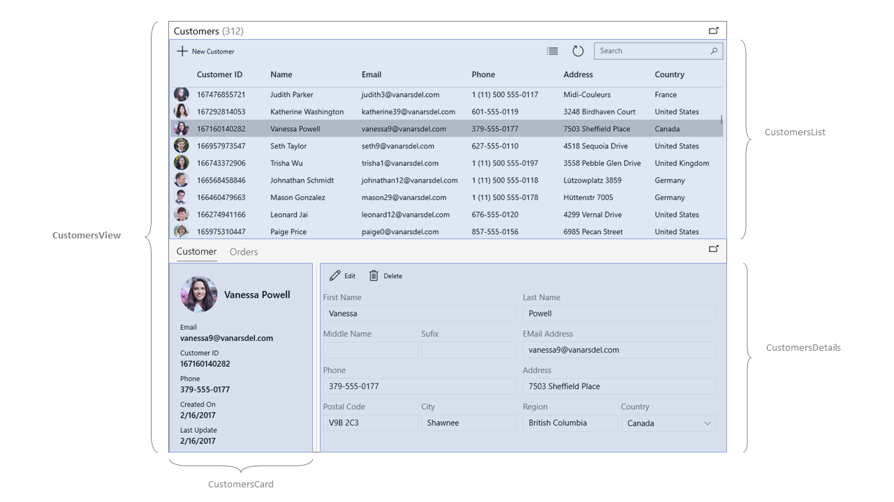
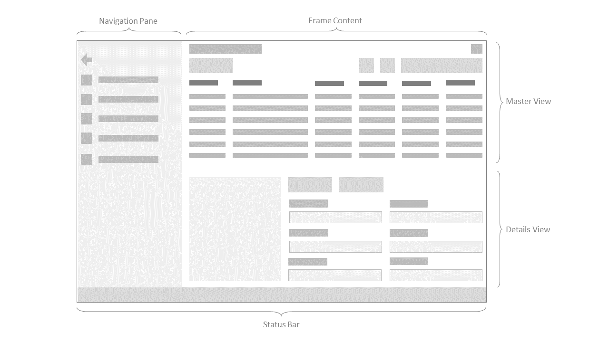
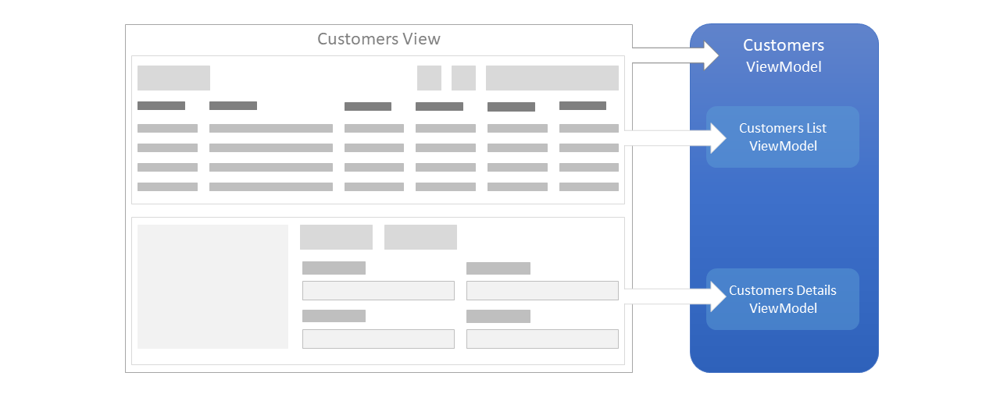
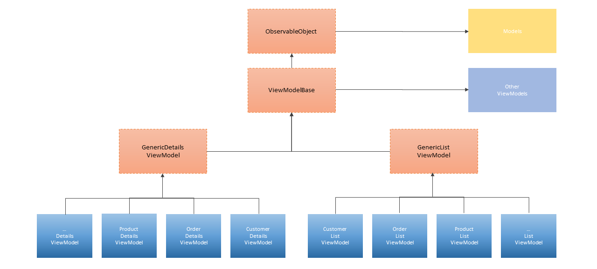
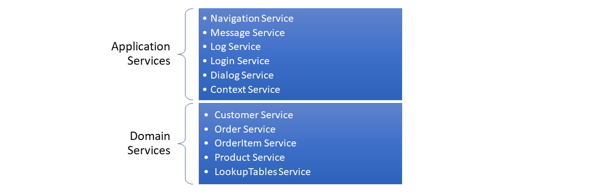
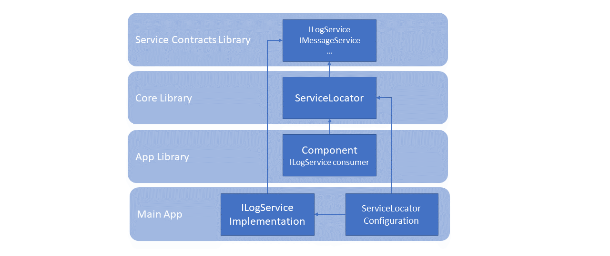

# Architecture Overview
**VanArsdel Inventory Sample** is based on a VMMV architecture pattern to facilitate the separation of the user interface from the business logic of the application. You can read more details about the MVVM pattern in the MVVM section of this documentation.

The following diagram shows the different layers in the application.



# Views
Views are essentially what the user sees on the screen to interact with the application. Examples of Views in this application are: CustomersView, OrdersView or ProductsView.

Views contains layers and controls to display the user interface. The layers organize the controls in the view, and the controls show the information to the user. All views depend on a view-model that manage the logic of the User Interface.

When you examine the code-behind of a view, you will notice that the first thing it does in the constructor is instantiate the view-model. Another thing to notice is the overridden of two methods: OnNavigatedTo and OnNavigatingFrom.

The OnNavigatedTo is executed when the user navigates to this view and is used to initialize the view-model with the parameters received in the navigation.

The OnNavigatingFrom is executed when the user navigates out of this view and is used to free the resources used by the view-model.

The following code shows a typical implementation of a view.

```csharp
    public class CustomersView : Page
    {
        public CustomersView()
        {
            ViewModel = ServiceLocator.Current.GetService<CustomersViewModel>();
            InitializeComponent();
        }

        public CustomersViewModel ViewModel { get; }

        protected override async void OnNavigatedTo(NavigationEventArgs e)
        {
            ViewModel.Subscribe();
            await ViewModel.LoadAsync(e.Parameter as CustomerListArgs);
        }

        protected override void OnNavigatingFrom(NavigatingCancelEventArgs e)
        {
            ViewModel.Unload();
            ViewModel.Unsubscribe();
        }
    }
```

In order to simplify the development and make the code more readable, views are subdivided in subviews.

For example, the CustomersView consists on the following subviews:
-	**CustomersList** – contains the list of customers and the controls to execute common actions over the collection of customers, such as: Add new customer, search customers or refresh customer list.
-	**CustomersDetails** – contains the details of a selected customer with input controls to enable the edition of the selected customer in the list. It also contains the common actions available for a customer, such as: Edit or delete.
-	**CustomersCard** – shows the main properties of the selected customer as a quick and read only view.
-	**CustomersOrders** – contains the list of orders associated to the selected customer.
-	**CustomersView** – is the top-level view containing all the subviews described before. 

The following image shows the diferent subviews contained in the CustomersView.




## Shell views
A Shell view is a special type of view. This view is the shell of a window and serves as a container for other views.

A Shell view contains a frame to enable the navigation between other views and a status bar on the bottom to notify messages to the user.

Anytime we open a new window in the application, a new Shell view is created, and the content is initialized using the frame to navigate to the specific view.

## MainShell view
The main window uses a specialized version of a Shell view: the MainShell view.

The MainShell view is like another Shell view but it contains a navigation pane on the left to offer the user different options to navigate to.

When you execute the application and log in, the MainShell view is created. There can be multiple Shell views in the application, but only one MainShell view.

The following image identifies the different elements in the MainShell view.



# ViewModels
View-models are another essential part in the MVVM architecture pattern. You can read more details about the concepts of the View-model in the MVVM – View Model section of this documentation.

The view-model contains the UI logic of the application, so it is reasonable to believe that there will be, at least, on view-model for each View. In some cases, where the view requires more complexity, more than one view-model are used for a single view.

To see how view-models are related to views, let’s see an example with the Customers view. The Customers view is associated with a Customers view-model and this view-model references two other view-models: CustomersList view-model and CustomersDetails view-model.

The following diagram shows this relationship.



## ViewModel hierarchy
Most of the properties and methods are common for all the different view-models so we use inheritance to reuse functionality.

The following diagram shows the view-models hierarchy.



### ObservableObject
The ObservableObject is the base class for all the objects that need to notify that a property has changed. This class contains a typical implementation of the INotifyPropertyChanged interface.

All view-model and model classes inherit from this object.

### ViewModelBase
This is the base class for all view-models in the application. It contains common members used by all view-models. It also contains a reference to the common services used by most of the view-models. These services are:
-	Navigation service
-	Message service
-	Dialog service
-	Log service
-	Context service

### GenericListViewModel
This is a generic class used by all the view-models that need to manage a list of elements. It contains common functionality used to query, select, add or delete elements from a data source. This functionality includes the following members:
-	Items – a generic list of items
-	ItemsCount – the number of items in the list
-	SelectedItem – the item currently selected
-	SelectedItems – list of items selected when in multi-selection mode
-	SelectedIndexRanges – list of range of items selected when using a virtual collection
-	Query – the text used to query and retrieve items from the data source
-	OnRefresh – abstract method executed to retrieve the list of items
-	OnNew – abstract method executed when the “New Item” command is invoked
-	OnDeleteSelection – abstract method to delete selected items

Please, refer to the GenericListViewModel source code for a detailed list of members implemented in this class.

### GenericDetailsViewModel
This is a generic class used by all the view-models that contains the details of a single item. It contains common functionality used to edit and delete an item. This functionality includes the following members:
-	Item – a generic item to be shown or modified
-	OnEdit – executed when the item edition starts
-	OnCancel – executed when the item edition is canceled
-	OnSave – executed when the item changes need to be saved
-	OnDelete – executed when the item is going to be deleted

Please, refer to the GenericDetailsViewModel source code for a detailed list of members implemented in this class.

# Models
Models are the third leg in the MVVM architecture pattern. You can read more details about the concepts of the Model in the MVVM – Views section of this documentation.

In this application, a model wraps the data of a business object to better expose its properties to the view. In other words, the business object is the raw data received from the data source while the Model is a “view friendly” version, adapting or extending its properties for a better representation of the data.

For example, the Customer business object contains the properties “Name” and “Last Name” and the CustomerModel expose also the property “FullName” as a concatenation of these two properties to be used in the Customer details view.

In a more complex scenario, the Customer business object contains only the “CountryCode” while the CustomerModel also expose the “CountryName” property updated from a lookup table if the “CountryCode” changes if, for instance, the user select a new country in a ComboBox control.

The Model also helps decouple the business objects used in the data layer from the classes used in the presentation layer, so if a change is required in a business object schema, the application will be less affected.

# Services
View-models make use of Services to execute the operations requested by the user, such as create, update or retrieve a list of customers or products. View-models also make use of Services to log the user activity, show dialogs or display a text in the status-bar by sending a message to the shell view.

Services contains the core functionality of the application. We distinguish two kinds of services:

-	**Application Services** – refers to those services implementing functionality regardless of the business of the application. Examples of application services are Navigation Service or Message Service that can be reused for any other application.
-	**Domain Services** (or Business Services) – implements the functionality specific for the business of the application. Examples of domain services are Customer Services or Product Services that are specific for a product management application.

The following diagram shows the two group of services used in this application:



## Application Services
Here is a brief description of the Application Services used in this application:

| Service | Description |
|---------|-------------|
| **Navigation Service** | Expose the functionality to navigate back and forward to a different view. It also offers the possibility to open a view in a new window. |
| **Message Service** | Enables communication between different components of the application without having to know anything about each other. The communication between components are based on a publishers-subscribers pattern. |
| **Log Service** | Offers the methods to write logs to a local repository to keep track of the user activity for debugging or auditing purposes. |
| **Login Service** | Implements the authentication and authorization mechanism to access the application. |
| **Dialog Service** | Offers methods to display a dialog message to the user for information or confirmation purposes. |
| **Context Service** | Exposes properties and methods related to the current execution context. This service is used internally to manage the execution in a multi-window environment where each window is executed in a different thread. |

## Domain Services
The domain services offer the CRUD (Create, Read, Update, Delete) operations over the business entities. Therefore, we have a specific service for Customers, Orders, OrderItems and Products.

To see the common methods used in these services, let’s examine the Customer service:
-	**GetCustomer(id)** – get a single customer by its id.
-	**GetCustomers(request)** – get a collection of customers matching the request parameters.
-	**GetCustomers(skip, take, request)** – same as GetCustomers(request) but returns only ‘take’ number of items starting from the ‘skip’ parameter.
-	**GetCustomersCount(request)** – return the number of Customers that match the request parameters.
-	**UpdateCustomer(customer)** – update or create a new Customer with the values contained in the customer parameter.
-	**DeleteCustomer(customer)** – delete the Customer specified by the customer parameter.

There is also a LookupTables Service used to retrieve information for common Tables such as Categories or CountryCodes. This service is used, for example, to get the name of a country by its code, or the tax rate for a specific tax type.

# Services and Dependency Injection
When we need to make use of a service, the first thing we need is a reference to the service. The easiest way to get a reference to a service could be just creating an instance of the required service.

For example, let’s say we need to write a log using the Log Service:

```csharp
    var logService = new LogService();
    logService.Write(message);
```

Simple and straightforward, but this approach could lead to further problems:
1.	We are assuming that the Log Service is implemented in the scope of the current library, but this is not always the case. In this application, most of the services used by view-models are implemented in a different library not referenced by the view-models library.
2.	We are creating a new instance to write a log, but, shouldn’t it be better to reuse the same instance in all the application? The answer depends on several factors and may be subject to changes in the future. In any case, the decision on how to create an instance of a service should be taken outside the component that uses the service.
3.	On the other hand, creating a hard reference to a service is also a bad idea if we are planning to test our application. When testing a component, we will need a mechanism to replace one or more services by a fake implementation to trace and check if the component is working as expected.

To solve these and other issues that can arise by using hard references, we make use of the Dependency Injection pattern.

With Dependency Injection, we get an instance of a service by using a ServiceLocator.

> **Note:**
> The ServiceLocator implemented in this application is based on the Microsoft.DependencyInjection.Abstractions package library.

To get an instance of a service using the ServiceLocator we can use the following code:

```csharp
    var logService = ServiceLocator.Request<ILogService>()
```

The first thing to note is that we are not creating an instance of a service, we are requesting a service specifying an interface.

This have the following considerations:
-	The ServiceLocator may return a new instance or reuse an existing instance of the service.
-	The ServiceLocator may return a real implementation of ILogService or a fake implementation for testing purposes.
-	Since we are requesting an interface, the service can be implemented in another library, out of the scope of the current component.

If the ServiceLocator returns a new instance, an existing instance, a real implementation or a fake implementation depends on the configuration of the service in the ServiceLocator.

The following diagram shows the relationship between components using a ServiceLocator.



As you can see in the diagram, the component consuming the ILogService can make use of the LogService, even when the service is implemented out of the scope of the component.

## Configuring the ServiceLocator
We saw already how to request a service using the ServiceLocator. Let’s see now how to configure the ServiceLocator to specify what service instance should be returned for each IService request.

The ServiceLocator implemented in this application relies on the ServiceCollection provided by the Microsoft DependencyInjection library to resolve the requests for a service.

To configure a service, we just need to associate a service interface with a service implementation.

The following example configures the ServiceLocator’s collection to return a new instance of the class LogServiceImp whenever a ILogService is requested:

```csharp
    public class ServiceLocator : IDisposable
    {
        static private ServiceProvider _rootServiceProvider = null;

        static public void Configure(IServiceCollection serviceCollection)
        {
            // ...
            serviceCollection.AddTransient<ILogService, LogService>();
            // ...
            _rootServiceProvider = serviceCollection.BuildServiceProvider();
        }
    }
```

If we later decide that is better to reuse the LogServiceImp for all the requests for a ILogService we just need to change the registration of the service as Singletone instead of Transient:

```csharp
    serviceCollection.AddSingletone<ILogService, LogService>();
```

There are some cases where we want to return a singleton instance for a service, but only under some circumstances.

For example, the Navigation service is used to navigate to another view in the application. Since the Navigation service relies on a single frame to navigate, we need to use always the same Navigation service for all the components.

But this is not necessarily true in a multi-window environment, because each window needs its own frame to navigate. Components executing in the same window needs a reference to the same Navigation service, but components executing in another window needs their own reference to its own Navigation service.

To solve this scenario, Microsoft DependencyInjection Library introduces the concept of scopes and scoped services. We can see a scope as a context to resolve scoped services. The following code configures a service as scoped.

```csharp
    serviceCollection.AddScoped<INavigationService, NavigationService>();
```

Scoped services are similar to singleton services when requested in the same scope. Requesting a scoped service in the same scope will return always the same instance but requesting a service in a different scope will return a different instance.

We, as developers, are responsible of creating a new scope when necessary. In this application, a new scope is created for each new window opened in the application. This way, when we request a INavigationService in one window we will receive a Navigation service to navigate in that window.

## Declaring dependencies in the constructor
When using the Dependency Injection pattern is very common to declare the required services in the constructor of the class.

For example, the Customer service depends on the ILogService and its constructor is declared as follows:

```csharp
    public CustomerService(ILogService logService)
    {
        LogService = logService;
    }

    private ILogService LogService { get; }
```

When we request a Customer service, the ServiceLocator examine the constructor and tries to resolve its dependencies. Since we did configure the ServiceLocator to resolve the ILogService, it will obtain the reference to the ILogService and pass it to the constructor of the Customer service.

Dependency Injection is not only used to resolve services, it is also used to resolve view-models and in general it could be used to resolve the instantiation of any class used in the application when required.

> **Note:**
> Only classes registered in the ServiceCollection can be resolved by using the ServiceLocator.

# Summary
VanArsdel Inventory Sample is based on a VMMV architecture pattern to facilitate the separation of the user interface from the business logic of the application. You can read more details about the MVVM pattern in the MVVM section of this documentation

