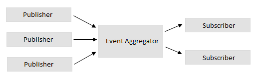

# Application Services

There are two types of services in the application: *Domain or Business services* and *Application or Infrastructure services*. The *Application services* are services that typically talk to external resources and are not part of the business domain, but at the same time they are also essential services to make the app works as expected.

The following table describes the Application services used in this application:

| Service | Description |
| ------- | ----------- |
| `INavigationService` | Service in charge of the navigation of the app | 
| `IMessageService` | Communication service between diffrent layers of the app |
| `ILogService` | Service to write the logs of the activity as well as possible exceptions |
| `IDialogService` | Abstraction for displaying alerts and confirmation messages to the user |
| `IFilePickerService` | Service that allows the app to access to the file system |
| `ISettingsService` | This service stores and provides the configurations and settings needed by the app |
| `IContextService` | This service is the one responsable of identify the context we are working with. Due our application could be executed in multiple windows, this kind of service is necessary |

Below we will describe more in details two of the more important services: INavigationService and IMessageServices.

## Navigation Service

Since we are using MVVM, and the ViewModel-First approach, we will use a Navigation Service abstraction to facilitate the ViewModel-based navigation. 

This kind of navigation, oposed to View-based navigation, is the navigation that uses a ViewModel as the subject that determines the navigation. The View isn't specified explicitly. Instead, there is a mechanism to associate each ViewModel with its corresponding View. This is where our Navigation Service comes in. It will perform the navigation itself, but also the will glue the ViewModel with its View.

### INavigationService

This *contract* is in charge of the Navigation of the app. The service is agnostic of the platform that is going to use it and that's why is located in the **Inventory.ViewModels** project. 

Let's take a look to the interface:
```csharp
public interface INavigationService
{
    bool IsMainView { get; }

    bool CanGoBack { get; }

    void Initialize(object frame);

    bool Navigate<TViewModel>(object parameter = null);
    bool Navigate(Type viewModelType, object parameter = null);

    Task<int> CreateNewViewAsync<TViewModel>(object parameter = null);
    Task<int> CreateNewViewAsync(Type viewModelType, object parameter = null);

    void GoBack();

    Task CloseViewAsync();
}
```

Let's review each one of these methods:

| Method |	Usage |
| ------ | ------ |
| Initialize | This method is needed in order to initialize the Navigation Service |
| Navigate | There are 2 overloads of this Method. Both the `Type` of the destination ViewModel is needed plus some arguments |
| CreateNewViewAsync | The inventory app example, allow us to create a View in a new Window. There are also 2 overloads of this method, and both need the target ViewModel to load |
| GoBack | Navigate back in the stack |
| CloseViewAsync | Close the actual Window |  

The Navigation Service sits between the View and the ViewModel. As the Navigate method takes the type of the ViewModel, our implementation will have to find the View that is associated with it. Let's review now how this interface is implemented.

### INavigationService implementation

The interface is implemented in the **Inventory.App** project by the `NavigationService` class. 

#### View Lookup
The Navigation Service will need a mechanism to associate Views to ViewModels. In our implementation, this is done using an internal dictionary.

Whenever the `Navigate` method is called, this dictionary will be queried for the Type of the View that corresponds to the ViewModel.

Let's take a look to the implementation of the `Navigate` method:

```csharp
public bool Navigate(Type viewModelType, object parameter = null)
{
    if (Frame == null)
    {
        throw new InvalidOperationException("Navigation frame not initialized.");
    }

    return Frame.Navigate(GetView(viewModelType), parameter);
}
```
In the first place, we're checking whether the `Frame` is null. The Frame property is the object that will perform the navigation at the UI side. It's usually set at the very beginning of the execution. In our application, inside the `ShellView.InitializeNavigation()` method, where the service is resolved.

In the second place, where are telling the `Frame` to navigate to the View associated to `viewModelType`. The lookup is done in `GetView`:
```csharp
static public Type GetView(Type viewModel)
{
    if (_viewModelMap.TryGetValue(viewModel, out Type view))
    {
        return view;
    }
    throw new InvalidOperationException($"View not registered for ViewModel '{viewModel.FullName}'");
}
```

#### View Registration

In order to know the association between a ViewModel and its View, some kind of registration is needed. For this effect, we will expose a method in our implementation:

```csharp
static public void Register<TViewModel, TView>() where TView : Page
{
    if (!_viewModelMap.TryAdd(typeof(TViewModel), typeof(TView)))
    {
        throw new InvalidOperationException($"ViewModel already registered '{typeof(TViewModel).FullName}'");
    }
}
```

It just adds the type of the ViewModel and the type of the View in a common dictionary.

The registration is usually done at the beginning of the execution, so all entries are available as soon as possible. In our application, you can locate the registration in the `Startup` class, inside the `ConfigureNavigation` method.

```csharp
private static void ConfigureNavigation()
{
    NavigationService.Register<ShellViewModel, ShellView>();
    NavigationService.Register<MainShellViewModel, MainShellView>();

    NavigationService.Register<DashboardViewModel, DashboardView>();
	...
}
```

### Additional functionalities

In our implementation, there are a few additional properties and methods to enable more advanced navigation scenarios, like to pop a new Window or close it programmatically. 

#### Opening new Windows

In our application, there are scenarios where we will feature multitasking by opening new Windows. It's provided by the `CreateNewViewAsync` methods.

Also, we made the functionality symmetrical by exposing the `CloseViewAsync` method, that is very easy to implement thanks to the `ApplicationViewSwitcher` static class.

```csharp
public async Task CloseViewAsync()
{
    int currentId = ApplicationView.GetForCurrentView().Id;
    await ApplicationViewSwitcher.SwitchAsync(MainViewId, currentId, ApplicationViewSwitchingOptions.ConsolidateViews);
}
```

## Message Service

Another service that it's important to know is the one represented by the interface `IMessageService`. The mission of this service is to send messages between decoupled components (Views, ViewModels, etc), and once the subscriber receive the message, react to it executing some action. This pattern is known as the **Event Aggregator Pattern**:



The `IMessageService` exposes the following methods:
```csharp
public interface IMessageService
{
    void Subscribe<TSender>(object target, Action<TSender, string, object> action) where TSender : class;
    void Subscribe<TSender, TArgs>(object target, Action<TSender, string, TArgs> action) where TSender : class;

    void Unsubscribe(object target);
    void Unsubscribe<TSender>(object target) where TSender : class;
    void Unsubscribe<TSender, TArgs>(object target) where TSender : class;

    void Send<TSender, TArgs>(TSender sender, string message, TArgs args) where TSender : class;
}
```

| Methods | Description |
| ------ | ------ |
| Subscribe | This is used to subscribe your class to a specific event. When we subscribe to an event, we need to indicate the sender (`TSender`), the target object, and the action to execute when the message is received |
| Unsubscribe | Unsubscribe an event already registered. It's important to unsubscribe events in order to avoid memory leaks |
| Send | Communicate to subscriber that a specific event has occurred. When we send a message we are passing the sender (`TSender`), the message that identifies the event occurred (`message`) and additional arguments when necessary |


### How to use it

The best thing to understand how it works is to check how it's being used in the *Inventory App*. For example, lets see how the `CustomersViewModel` loads the detail of a Customer, when it is selected from the List of Customers. In this process the following actors are involved:

- `CustomerListViewModel`: When an element of the list is selected, this ViewModel will use the `IMessageService` to send to the Customer selected to the possible subscribers.

```csharp
private TModel _selectedItem = default(TModel);
public TModel SelectedItem
{
    get => _selectedItem;
    set
    {
        if (Set(ref _selectedItem, value))
        {
            if (!IsMultipleSelection)
            {
                MessageService.Send(this, "ItemSelected", _selectedItem);
            }
        }
    }
}
```

- `CustomersViewModel`: This ViewModel will *Subcribe* to the Customers list *ItemSelected* event. It will also unsubscribe from this event when necessary. 
```csharp
public void Subscribe()
{
    MessageService.Subscribe<CustomerListViewModel>(this, OnMessage);
    CustomerList.Subscribe();
    CustomerDetails.Subscribe();
    CustomerOrders.Subscribe();
}

private async void OnMessage(CustomerListViewModel viewModel, string message, object args)
{
    if (viewModel == CustomerList && message == "ItemSelected")
    {
        await ContextService.RunAsync(() =>
        {
            OnItemSelected();
        });
    }
}

private async void OnItemSelected()
{
    if (CustomerDetails.IsEditMode)
    {
        StatusReady();
        CustomerDetails.CancelEdit();
    }
    CustomerOrders.IsMultipleSelection = false;
    var selected = CustomerList.SelectedItem;
    if (!CustomerList.IsMultipleSelection)
    {
        if (selected != null && !selected.IsEmpty)
        {
            await PopulateDetails(selected);
            await PopulateOrders(selected);
        }
    }
    CustomerDetails.Item = selected;
}
```

We are executing the `OnItemSelected` method when we received from the `CustomerListViewModel` a message `ItemSelected`.

Finally, as we previously mentioned, it's important to control the subscriptions and unsubcriptions of the events to prevent memory leaks. We will do this overriding the events `OnNavigatedTo` and `OnNavigatingFrom`methods of our Views:
```csharp
protected override async void OnNavigatedTo(NavigationEventArgs e)
{
    ViewModel.Subscribe();
    await ViewModel.LoadAsync(e.Parameter as CustomerListArgs);
}

protected override void OnNavigatingFrom(NavigatingCancelEventArgs e)
{
    ViewModel.Unload();
    ViewModel.Unsubscribe();
}
```

### Message Service Implementation

The purpouse of this section is to show how an *Event Aggregator Pattern* can be implemented. The key to unsderstand the whole process are the `Subscriber` and `Subscriptions` internal classes.

#### Subscriptions class

This class is just a Diccionary of actions associated with a `Type`. We will use it to store the action to execute when a Subscriber receives a message.

```csharp
class Subscriptions
{
    private Dictionary<Type, Delegate> _subscriptions = null;

    public Subscriptions()
    {
        _subscriptions = new Dictionary<Type, Delegate>();
    }

    public bool IsEmpty => _subscriptions.Count == 0;

    public void AddSubscription<TSender, TArgs>(Action<TSender, string, TArgs> action)
    {
        _subscriptions.Add(typeof(TArgs), action);
    }

    public void RemoveSubscription<TArgs>()
    {
        _subscriptions.Remove(typeof(TArgs));
    }

    public void TryInvoke<TArgs>(object sender, string message, TArgs args)
    {
        var argsType = typeof(TArgs);
        foreach (var keyValue in _subscriptions.Where(r => r.Key.IsAssignableFrom(argsType)))
        {
            var action = keyValue.Value;
            action?.DynamicInvoke(sender, message, args);
        }
    }
}
```

#### Subscriber class

The Subscriber class is the responsable of:

- Container of the subscriptions defined for a specific `Type`. 
- Create the `WeakReference` between the Publisher and the Subscriber.
- Unregister subscriptions.
- Invoke the action to execute when the subscriber receives a message.

```csharp
class Subscriber
{
    private WeakReference _reference = null;

    private Dictionary<Type, Subscriptions> _subscriptions;

    public Subscriber(object target)
    {
        _reference = new WeakReference(target);
        _subscriptions = new Dictionary<Type, Subscriptions>();
    }

    public object Target => _reference.Target;

    public bool IsEmpty => _subscriptions.Count == 0;

    public void AddSubscription<TSender, TArgs>(Action<TSender, string, TArgs> action)
    {
        if (!_subscriptions.TryGetValue(typeof(TSender), out Subscriptions subscriptions))
        {
            subscriptions = new Subscriptions();
            _subscriptions.Add(typeof(TSender), subscriptions);
        }
        subscriptions.AddSubscription(action);
    }

    public void RemoveSubscription<TSender>()
    {
        _subscriptions.Remove(typeof(TSender));
    }
    public void RemoveSubscription<TSender, TArgs>()
    {
        if (_subscriptions.TryGetValue(typeof(TSender), out Subscriptions subscriptions))
        {
            subscriptions.RemoveSubscription<TArgs>();
            if (subscriptions.IsEmpty)
            {
                _subscriptions.Remove(typeof(TSender));
            }
        }
    }

    public void TryInvoke<TArgs>(object sender, string message, TArgs args)
    {
        var target = _reference.Target;
        if (_reference.IsAlive)
        {
            var senderType = sender.GetType();
            foreach (var keyValue in _subscriptions.Where(r => r.Key.IsAssignableFrom(senderType)))
            {
                var subscriptions = keyValue.Value;
                subscriptions.TryInvoke(sender, message, args);
            }
        }
    }
}
```

#### IMessageService implementation

Once we understand how the internal classes `Subscriptions` and `Subscriber` work, the implementation of the `IMessageService` becomes much simplier. These are the implementation of main three methods of `IMessageService`:

- **Subscribe**: We are just simply creating a new `Subscriber` in case it wasn't already defined, and associate an `Action` to be executed.
```csharp
public void Subscribe<TSender, TArgs>(object target, Action<TSender, string, TArgs> action) where TSender : class
{
    if (target == null)
        throw new ArgumentNullException(nameof(target));
    if (action == null)
        throw new ArgumentNullException(nameof(action));

    lock (_sync)
    {
        var subscriber = _subscribers.Where(r => r.Target == target).FirstOrDefault();
        if (subscriber == null)
        {
            subscriber = new Subscriber(target);
            _subscribers.Add(subscriber);
        }
        subscriber.AddSubscription<TSender, TArgs>(action);
    }
}
```

- **Unsubscribe**: Just remove a subscription for the collection.
```csharp
public void Unsubscribe(object target)
{
    if (target == null)
        throw new ArgumentNullException(nameof(target));

    lock (_sync)
    {
        var subscriber = _subscribers.Where(r => r.Target == target).FirstOrDefault();
        if (subscriber != null)
        {
            _subscribers.Remove(subscriber);
        }
    }
}
```

- **Send**: Execute the actions associated to Subscribers when a specific event occurs.

```csharp
public void Send<TSender, TArgs>(TSender sender, string message, TArgs args) where TSender : class
{
    if (sender == null)
        throw new ArgumentNullException(nameof(sender));

    foreach (var subscriber in GetSubscribersSnapshot())
    {
        // Avoid sending message to self
        if (subscriber.Target != sender)
        {
            subscriber.TryInvoke(sender, message, args);
        }
    }
}
```
