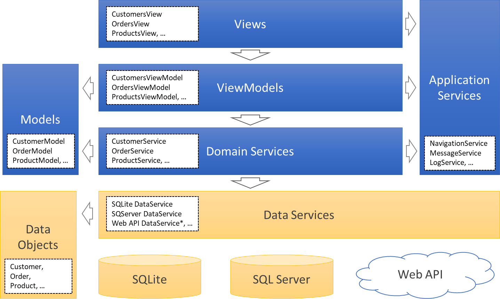
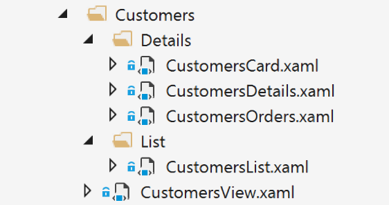

# Architecture Overview
VanArsdel Inventory Sample is based on a VMMV architecture pattern to facilitate the separation of the user interface from the business logic of the application. You can read more details about the MVVM pattern in the MVVM section of this documentation.

The following diagram shows the different layers involved in the design of the architecture and the relationship between them.

# Views
Views are essentially what the user sees on the screen to interact with the application. Examples of Views in this application are: CustomersView, OrdersView or ProductsView.
In order to simplify the development and make the code more readable, views are subdivided in subviews. For example, the CustomersView consists on the following subviews:
-	CustomersList – contains the list of customers and the controls to execute common actions over the collection of customers, such as: Add new customer, search customers or refresh customer list.
-	CustomersDetails – contains the details of a selected customer with input controls to enable the edition of the selected customer in the list. It also contains the common actions available for a customer, such as: Edit or delete.
-	CustomersCard – shows the main properties of the selected customer as a quick and read only view.
-	CustomersOrders – contains the list of orders associated to the selected customer.
-	CustomersView – is the top-level view containing all the subviews described before. 

The following image shows how the Customers view and subviews are organized in the Solution Explorer.

